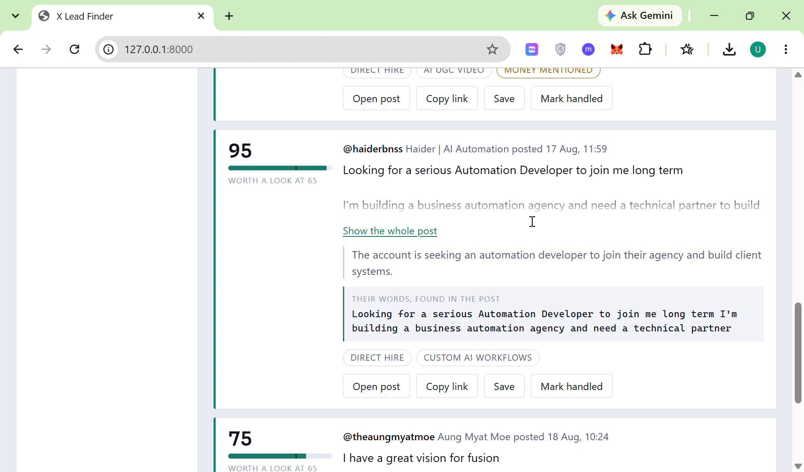
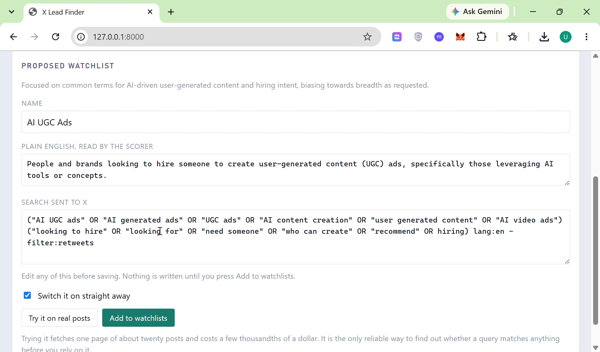
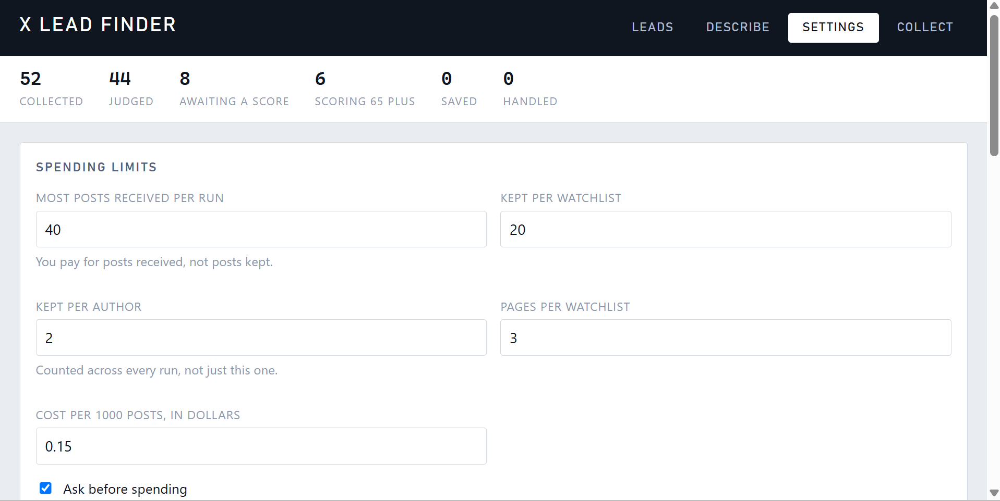

# X Lead Finder

Finds people on X who are actively looking to pay someone for AI UGC
video, custom AI workflows, or automation work, and puts them in a
reviewable list with a score, a reason, and the author's own words as
proof.

No automatic outreach. Nothing is ever sent on your behalf.

---

## Demo

A two minute walkthrough showing a plain English query turned into a
live search, and the leads it returns.

Watch it here: https://www.youtube.com/watch?v=_OXjS63vdm4





---

## 1. What it does

It works in two stages, and the second one is the point.

**Stage one, a cheap wide net.** X advanced search pulls posts matching
your keywords. This is the part that costs money, so it is capped,
counted, and never asked for the same post twice.

**Stage two, an AI judge.** Every post collected is read by Google
Gemini, which scores it out of 100 for how likely the author is to pay
somebody for this work. It returns a category, a one line reason, and a
quote from the post proving its answer.

Keyword search alone returns mostly noise. An AI reading every post on
X would be unaffordable. Running them in that order means the expensive
judgement only ever sees pre-filtered posts, which cuts the AI cost by
roughly ninety five percent while removing about eighty five percent of
the noise.

### The evidence check

The model is required to quote the exact words that prove intent. The
program then checks that quote really appears in the post. If it does
not, the score is capped below the review threshold and the lead is
marked "score held back".

This matters because a model can invent a convincing reason. It cannot
invent its way past a string comparison. On a real test run this caught
a job board relaying somebody else's vacancy that had been scored 95,
and dropped it to 25.

You do not have to take that on trust. Run the tests:

```
python test_score.py
python test_collect.py
```

Thirty one checks, well under a second, no API keys and no cost.
The first file confirms that an exact quote is accepted, that a quote
with tidied punctuation is still accepted, that an invented quote is
rejected, and that a score of 95 with unfindable evidence comes back
capped at 39 with the original claim recorded alongside it.

The second file covers the spending cap. It runs real collections
against a fake supplier and checks that every post paid for is
counted, including the posts bought before a run failed part way
through. A cap that forgets what it spent on the failure path is not
a cap.

### What you see

A local web app at `http://127.0.0.1:8000` with four tabs.

- **Leads.** Every judged post, best first, with filters for score,
  watchlist, category, review state, keywords, money mentioned, and one
  post per author. Save and Mark handled are remembered permanently.
- **Describe.** Type a plain English sentence such as *people looking
  for someone to build a custom AI workflow*. The model turns it into a
  working X search query, warns you about the mistakes that reliably
  return nothing, lets you test it against real posts, and saves it as a
  new watchlist. No code, no query syntax to learn.
- **Settings.** Edit watchlists and spending limits in the browser.
  config.yaml is never opened by hand.
- **Collect.** Run a collection, score new posts, or re-judge
  everything under the current rules. The cost is shown and confirmed
  before anything is spent.

There is also an unattended mode. `python watch.py` collects, scores
and refreshes on a timer, and once a day sends a digest of the best new
leads to Slack or email. A tool is judged by whether it reaches you
without being opened.

---

## 2. Install

You need Python 3.10 or newer, and two free API keys. Setup takes about
five minutes. No developer help required.

### Step 1. Get your two keys first

Do this before installing, so you are not stopped halfway.

| Key | Where from | Cost |
| --- | --- | --- |
| `TWITTER_API_KEY` | twitterapi.io, sign in with Google | Free starter credits, no card |
| `GEMINI_API_KEY` | aistudio.google.com, click Get API key | Permanently free, no card |

Keep both open in a tab. You will paste them in at Step 3.

### Step 2. Install the program

Open a terminal in the project folder and run these one at a time.

On Windows, in PowerShell:

```
python -m venv venv
.\venv\Scripts\Activate.ps1
pip install -r requirements.txt
copy .env.example .env
```

On Mac or Linux, in Terminal:

```
python3 -m venv venv
source venv/bin/activate
pip install -r requirements.txt
cp .env.example .env
```

You will know it worked when `(venv)` appears at the start of your
command prompt.

### Step 3. Paste your keys in

Open the new `.env` file in a plain text editor such as VS Code,
Notepad++, or TextEdit. Replace the two placeholder lines:

```
TWITTER_API_KEY=paste_your_twitterapi_io_key_here
GEMINI_API_KEY=paste_your_google_ai_studio_key_here
```

Write the key straight after the equals sign. No quotes, no spaces,
nothing after it. Save and close.

### Step 4. Check the keys work

```
python test_connection.py
```

This asks X for a handful of real posts and prints them. It costs a
fraction of a cent. If you see posts, or the message that the
connection worked but nothing matched right now, you are ready. If the
key is wrong, it tells you exactly that instead of failing silently.

### Step 5. Start the app

```
python app.py
```

Then open `http://127.0.0.1:8000` in your browser.

To stop the app, press Ctrl and C in the terminal window.

### Coming back to it later

The virtual environment has to be switched on each time you open a new
terminal. You do not reinstall anything.

```
.\venv\Scripts\Activate.ps1     (Windows)
source venv/bin/activate        (Mac or Linux)
python app.py
```

### If something goes wrong

| What you see | What to do |
| --- | --- |
| PowerShell refuses to run the activate script | Run `Set-ExecutionPolicy -Scope CurrentUser RemoteSigned` once, then try again |
| `python` is not recognised | Try `python3`, or reinstall Python with the "Add to PATH" box ticked |
| The browser page will not load | Check the terminal is still running. The app only works while that window is open |
| Your Google key was rejected | The key is wrong or has a stray space. Re-copy it into `.env` |
| The server rejected your key | Same, but for the twitterapi.io key |
| The leads list is empty | Nothing has been collected yet. Go to the Collect tab and run a collection |
| The digest is empty | Run `python check_data.py`. It explains why in plain English and changes nothing |

---

## 3. How to change what it watches

Open the app, click **Settings**, and edit the watchlists there. Each
one has:

- a **name** you will recognise
- a **description** in plain English, which the AI judge reads to decide
  what counts as a match
- a **query**, the search sent to X
- an on and off switch

Or use the **Describe** tab and let the model write the query for you.

Everything is saved to `config.yaml`, with the previous version kept as
`config.backup.yaml`. You never need to touch the file directly, and if
you do, do not use Notepad, which mangles the spacing.

### Writing a query that works

The single most common mistake is asking for too much at once. Every
extra required phrase multiplies the chance of matching nothing.

Use two required groups and no more:

```
(topic words OR joined OR by OR OR) ("looking for" OR "need someone" OR hiring) lang:en -filter:retweets
```

Forty loosely relevant posts beat zero perfect ones, because the AI
judge reads every result and throws the noise away. The app warns you
when a query breaks this rule.

### Other settings worth knowing

Anything marked "Settings tab" can be changed in the browser. The rest
live in `config.yaml` and are edited with a plain text editor. Saving
from the Settings tab never touches the file-only settings.

| Setting | Where | What it does |
| --- | --- | --- |
| `max_posts_per_run` | Settings tab | Ceiling for a single collection |
| `max_posts_per_watchlist` | Settings tab | Ceiling for one watchlist per run |
| `max_posts_per_author` | Settings tab | Stops one loud account filling your results |
| `max_pages_per_watchlist` | Settings tab | How many pages to request per watchlist |
| `cost_per_1000_posts` | Settings tab | Used for the cost estimate shown before spending |
| `confirm_before_spending` | Settings tab | Asks you to confirm before any run that costs money |
| `daily_post_cap` | `config.yaml` | Hard daily limit on posts bought, shared by every route |
| `only_new_posts` | `config.yaml` | Asks only for posts newer than the last check |
| `data_source` | `config.yaml` | `twitterapi` or `officialx`. Swap supplier without code changes |
| `watcher.poll_every_minutes` | `config.yaml` | How often unattended mode collects |
| `watcher.digest_at` | `config.yaml` | What time the daily summary is sent |
| `watcher.digest_min_score` | `config.yaml` | Lowest score worth putting in the digest |

---

## 4. What it costs per month

Data comes from twitterapi.io at about $0.15 per 1000 posts received.
The AI judging is free: Google's free tier covers roughly 1500 requests
a day, and posts are judged twenty at a time, so 30,000 posts a day
would still fit.

You pay for posts **received**, not posts kept.

| Usage | Posts per day | Per month | Cost per month |
| --- | --- | --- | --- |
| Light, one watchlist checked hourly | 200 | 6,000 | about $0.90 |
| Steady, three watchlists on a ten minute cycle | 1,000 | 30,000 | about $4.50 |
| Heavy, continuous monitoring across many topics | 5,000 | 150,000 | about $22.50 |

For comparison, the official X API charges about $0.005 per post read.
The same light usage would cost roughly $30 a month there, and the
tiers that allow real time streaming start at $5,000 a month.

Run `python spend.py` at any time to see what today and this month have
actually cost.

---

## What you should know before relying on it

Four things stated plainly, because you will find them out eventually
and it is better to hear them now.

**This polls, it does not stream.** True real time streaming on X is
restricted to plans starting at $5,000 a month. This checks every few
minutes instead. In practice a lead posted at 10:00 reaches you by
10:10, which for freelance outreach is fast enough.

**The data supplier scrapes rather than licenses.** twitterapi.io is a
third party and its collection method sits against X's terms of
service. It is used here because the official API has no free tier for
new developers as of February 2026. The data source is designed to be
swappable, so an organisation that needs strict compliance can move to
the official API without changing anything else.

**Google's free tier may use prompts for training.** Only public posts
are sent, never your keys, your notes, or anything private. If that is
still unacceptable, a paid Gemini key removes it with no code change.

**The AI is a filter, not an oracle.** It is right most of the time and
wrong some of the time, which is why every score carries a reason and a
verified quote, and why nothing is ever contacted automatically. A
human reads the list. The tool's job is to make that list short enough
to read.

---

## The files, briefly

| File | What it is |
| --- | --- |
| `app.py` | The web app. Start here. |
| `dashboard_app.html` | The page the app serves |
| `build_dashboard.py` | Writes a standalone `dashboard.html`, no server needed |
| `dashboard.html` | That standalone page. Refreshed by unattended mode |
| `collect.py` | Buys posts from the supplier. The only file that spends |
| `score.py` | Judges posts with Gemini. Free |
| `query_builder.py` | Turns plain English into a search query |
| `spend.py` | The shared spending ledger |
| `watch.py` | Unattended mode, on a timer |
| `digest.py` | The daily summary, to Slack or email |
| `check_data.py` | Explains why a digest is empty. Changes nothing |
| `test_score.py` | Tests for the evidence check. No keys, no cost |
| `test_collect.py` | Tests for the spend ledger. No keys, no cost |
| `config.yaml` | Every setting. Editable in the browser |
| `data/` | Your posts, scores, review marks and ledger. Stays local |

---

## License

MIT. See [LICENSE](LICENSE). You are free to use, modify and
redistribute this, including commercially. It is provided as is, with
no warranty.
